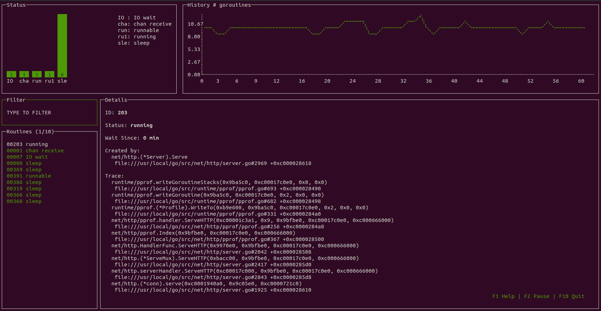

# roumon


[![Go Report Card][go-report-image]][go-report-url]
[![PRs Welcome][pr-welcome-image]][pr-welcome-url]
[![License][license-image]][license-url]
[](https://pkg.go.dev/github.com/becheran/roumon)
[](https://coveralls.io/github/becheran/roumon?branch=main)

[license-url]: https://github.com/becheran/roumon/blob/main/LICENSE
[license-image]: https://img.shields.io/badge/License-MIT-brightgreen.svg
[go-report-image]: https://goreportcard.com/badge/github.com/becheran/roumon
[go-report-url]: https://goreportcard.com/report/github.com/becheran/roumon
[pr-welcome-image]: https://img.shields.io/badge/PRs-welcome-brightgreen.svg
[pr-welcome-url]: https://github.com/becheran/roumon/blob/main/CONTRIBUTING.md

A go**rou**tine **mon**itor to keep track of active routines from within your favorite shell.



## Features

* Track live state of all active goroutines
* Terminal user interface written with [termui](https://github.com/gizak/termui) 🤓
* Simple to integrate [pprof server](https://golang.org/pkg/net/http/pprof/) for live monitoring
* Dynamic history of goroutine count
* Full-text filtering
* Overview of routine states

## Installation

```sh
go get github.com/becheran/roumon
```

Or download the pre-compiled binaries from the [releases page](https://github.com/becheran/roumon/releases).

## Usage

Before starting roumon, the go app which shall be monitored needs to be prepared to export pprof infos via http.

### pprof

The program which shall be monitored needs to run a [pprof server](https://golang.org/pkg/net/http/pprof/).

Import pprof into you program:

``` go
import _ "net/http/pprof"
```

Run a webserver which will listen on a specific port:

``` go
go func() {
    log.Println(http.ListenAndServe("localhost:6060", nil))
}()
```

Start your program and check that the `pprof` site is available in you web-browser:  `http://localhost:6060/debug/pprof`

### roumon

Start *roumon* in from your command line interface. Use optional arguments if needed.

For example `roumon -debug=logfile -host=192.168.10.1 -port=8081` will start the routine monitor for the *pprof profiles* exposed to `192.168.10.1:8081` and write a debug logfile to `./logfile`.

Run *roumon* with `-h` or `--help` to see all commandline argument options:

``` txt
Usage of roumon:
  -debug string
        Path to debug file 
  -host string
        The pprof server IP or hostname (default "localhost")
  -port int
        The pprof server port (default 6060)
```

From within the *Terminal User Interface (TUI)* hit `F1` for help `F10` or `ctrl-c` to stop the application.

## Contributing

Pull requests and issues [are welcome](./CONTRIBUTING.md)!
